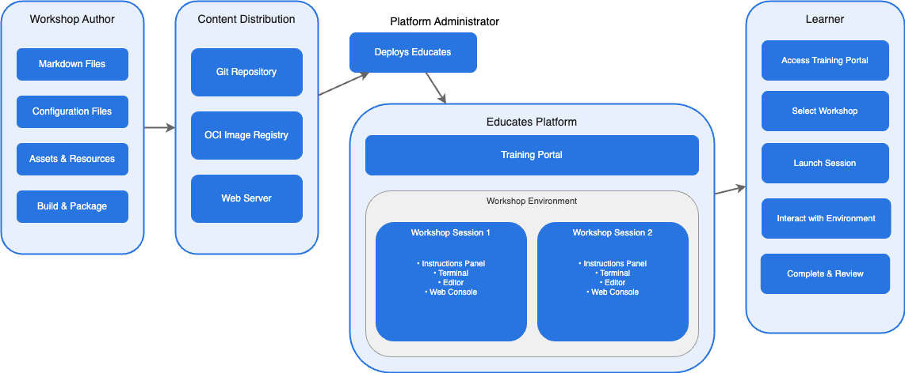
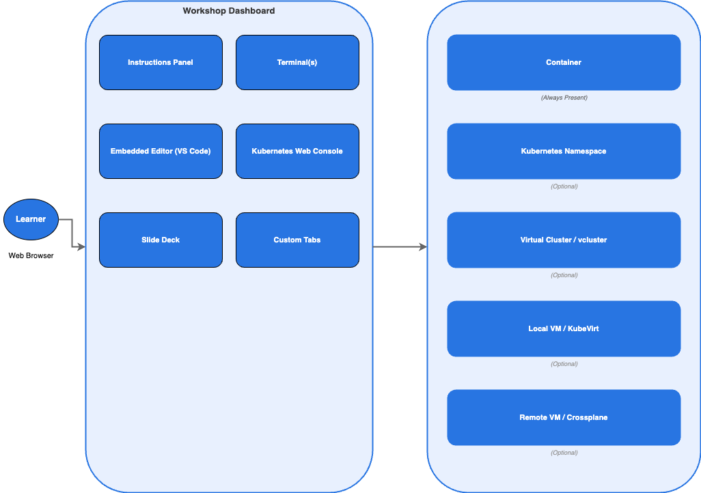

Platform Architecture
=====================

Educates has a layered architecture made up of three main concerns: how workshop content is authored and distributed, what each user gets when they start a workshop session, and how the platform is deployed and manages sessions at scale. This page covers each of these layers, starting with a high-level view before diving into the Kubernetes-specific internals.

Content authoring and distribution
----------------------------------

Workshop content is authored as a set of Markdown files that provide the step-by-step instructions a user will follow. These are accompanied by configuration files that define the workshop metadata, the runtime environment required, any resources that should be pre-created, and the access controls to apply.

Content is rendered into the workshop dashboard using Hugo, which generates static HTML from the Markdown source using custom layouts provided by Educates.

When a workshop is deployed, the platform needs to pull the content from a distribution source. Three mechanisms are supported:

* **Hosted Git repository** — The platform clones the workshop content directly from a Git repository at the URL specified in the workshop definition.

* **OCI image registry** — Workshop content can be packaged as an OCI artefact and pushed to any OCI-compatible image registry. The platform pulls the artefact and extracts the content when setting up a workshop environment.

* **Web server** — Content can be served from any HTTP-accessible location. The platform downloads the content archive from the specified URL.

In addition to the content files, a workshop can use a custom container image that bundles the content along with any additional tools, language runtimes, or CLI utilities that users will need during the workshop.

The workshop session
--------------------

When a user starts a workshop, they are given their own isolated session. The primary interface is the workshop dashboard, which is displayed in the user's web browser. The dashboard is split into two halves: the instructions panel on the left and a set of tabbed views on the right.

The dashboard provides the following components:

* **Instructions panel** — Renders the workshop Markdown as formatted instructions. Commands embedded in the instructions can be annotated as clickable, so that clicking them automatically executes the command in the correct terminal. Text snippets can be marked as copyable, so that clicking them copies the text to the browser clipboard.

* **Terminals** — One or more terminal sessions are available directly in the dashboard. These connect to the workshop container and provide a shell where users can run commands.

* **Embedded editor** — An IDE based on VS Code can be enabled, giving users a graphical editor for working with files during the workshop.

* **Kubernetes web console** — For Kubernetes-focused workshops, a web-based console (using the Kubernetes dashboard) can be enabled for browsing and interacting with cluster resources.

* **Slide deck** — Slides can be displayed alongside the instructions, useful for instructor-led workshops. HTML-based presentation tools such as ``reveal.js`` or ``impress.js`` can be used, or a PDF can be embedded.

* **Custom tabs** — Additional web-based applications specific to the workshop topic can be integrated into the dashboard as extra tabs.

Workshop environment options
----------------------------

Behind the dashboard, each session is connected to a runtime environment. The level of infrastructure access is configured per workshop, depending on what the topic requires:

* **Container only** — The user works inside a single container. This is the baseline for every session and is suitable for workshops on programming languages, CLI tools, or applications that don't require Kubernetes.

* **Kubernetes namespace** — The user gets a dedicated namespace in a shared Kubernetes cluster. Resource quotas and role based access control (RBAC) are applied to prevent users from interfering with each other. This is suitable for workshops that involve deploying workloads to Kubernetes without needing cluster-level access.

* **Virtual Kubernetes cluster** — A per-session virtual cluster (using [vcluster](https://www.vcluster.com/)) gives the user full cluster-level access, including cluster admin privileges, without provisioning a separate physical cluster.

* **Local virtual machine** — A VM running on the Kubernetes nodes can be provisioned using [KubeVirt](https://kubevirt.io/), giving users a complete Linux environment with administrator access.

* **Remote virtual machine** — Integrations with infrastructure-management operators such as [Crossplane](https://www.crossplane.io/) can be used from a workshop session to provision a distinct VM on an external infrastructure provider.

These options can be combined. A single workshop can give users access to a container, a Kubernetes namespace, and a VM at the same time if the training material calls for it.

Deployment to Kubernetes
------------------------

The primary deployment model for Educates is to a Kubernetes cluster. In this mode, a Kubernetes operator manages the lifecycle of workshops and user sessions. The operator is controlled through a set of custom resource types specific to Educates.

The typical deployment flow is:

1. An administrator loads one or more ``Workshop`` definitions into the cluster, specifying where the content is hosted and what environment each workshop requires.

2. The administrator creates a ``TrainingPortal`` resource, which triggers the deployment of a web-based training portal. The portal can serve one or more workshops.

3. When a user accesses the training portal and selects a workshop, the portal creates (or allocates from a reserve pool) a ``WorkshopSession``, and the user is redirected to their own isolated session.

The custom resource types involved are:

* ``Workshop`` — Defines a workshop, including where the content is hosted (Git repository, OCI image, or web server), any additional tools required, resources to be pre-created for each session or shared across all sessions, and the resource quotas and access roles for the workshop.

* ``TrainingPortal`` — Triggers the deployment of a training portal instance. A training portal can provide access to one or more distinct workshops and handles user registration, session management, and a REST API for programmatic access.

* ``WorkshopEnvironment`` — Created by the training portal to set up the environment for a particular workshop, including a namespace for shared resources and the infrastructure needed to run sessions.

* ``WorkshopSession`` — Created by the training portal to provision an individual user session within a workshop environment. Sessions can be pre-created in reserve for fast allocation, or created on demand.

Each workshop session is associated with one or more Kubernetes namespaces. RBAC applied to a unique Kubernetes service account for the session ensures that the user can only access the namespaces and resources that the workshop allows.

The training portal also exposes a REST API, allowing custom front ends to be created that integrate with external identity providers and provide an alternate way of browsing and launching workshops.

Local deployment
-----------------

For quick local use, a single workshop can be run directly using a container runtime such as Docker (or any runtime with a compatible API), without needing a full Kubernetes cluster. This is useful for trying out a workshop, running a product demo on a laptop, or situations where Kubernetes is not available. In this mode the workshop runs in a single container and does not have access to Kubernetes namespaces, virtual clusters, or VMs.

For workshop content development, the Educates CLI can create a local Kubernetes cluster using Kind, deploy Educates into it, and provide a fast iteration workflow backed by a local image registry. This gives content authors the full platform experience — including Kubernetes namespaces and all dashboard features — on their own machine.

The Educates CLI
----------------

The ``educates`` command line tool simplifies common operations across both local and hosted deployments:

* **Local development** — ``educates create-cluster`` creates a Kind cluster with Educates pre-installed. ``educates deploy-workshop`` and ``educates delete-workshop`` manage workshops. ``educates browse-workshops`` opens the training portal in a browser.

* **Content authoring** — ``educates new-workshop`` generates a new workshop from a template. ``educates publish-workshop`` builds and publishes workshop content to a registry.

* **Cluster management** — For hosted Kubernetes clusters, the CLI can perform opinionated installs of Educates to infrastructure providers such as AWS, GCP, and Azure.

For production deployments, administrators will typically work directly with the Kubernetes custom resources for full control over the configuration.
